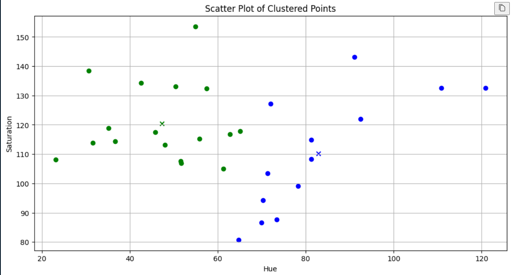
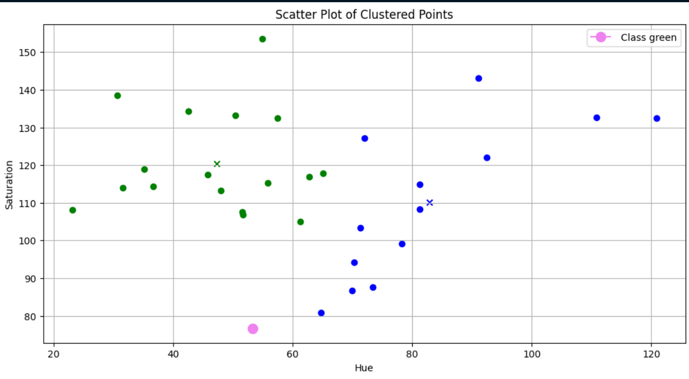

# MLPR_LAB5

The goal of this lab was to make a plaksha faculty faces and then applying Kmeans on them after which Dr Shashis face was used as a test. First we used open-cv's cascade classifier to get all the faces after which Kmeans was applied to cluster them according to their hue and saturation. After doing that Dr Shashis face was used to see how well kmeans fared. 

